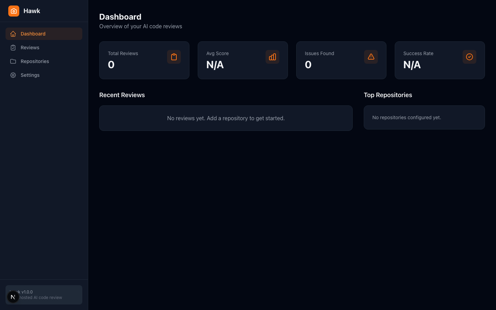
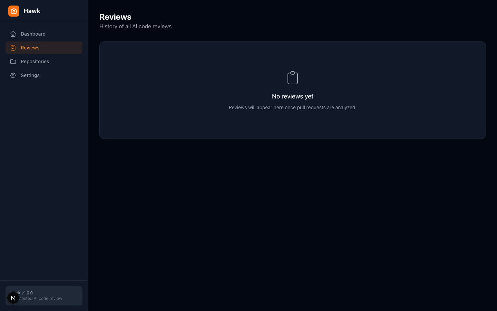
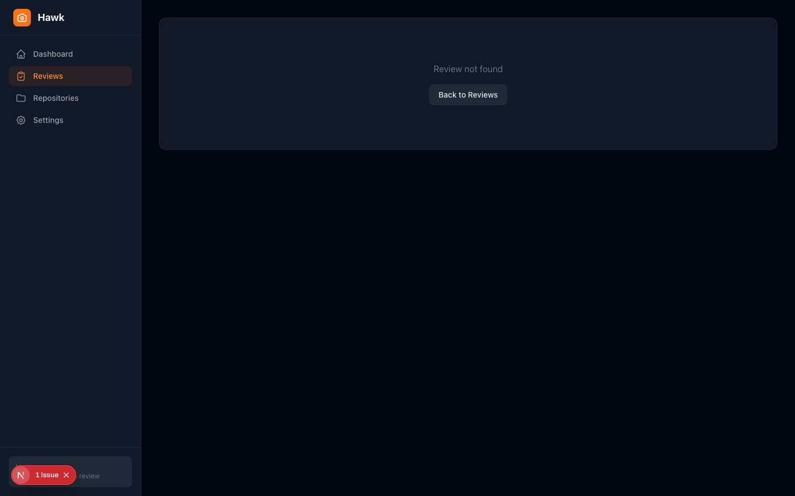
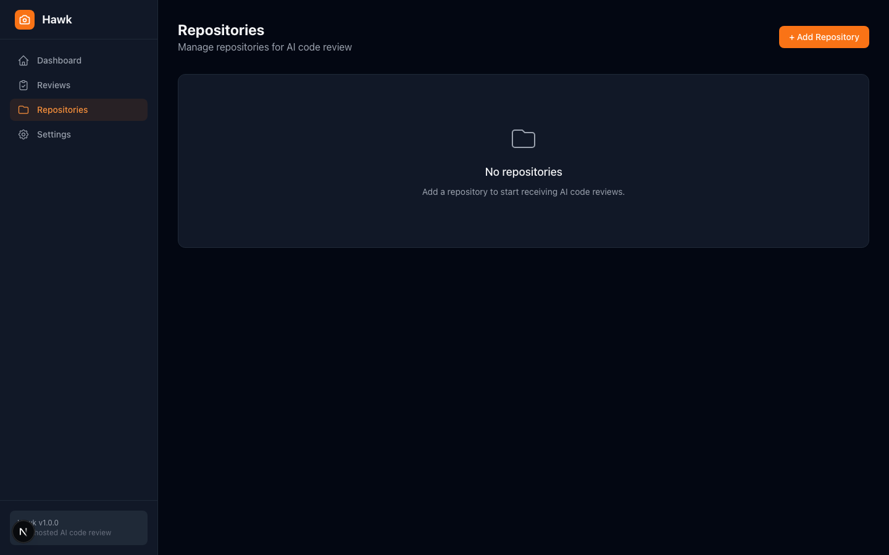
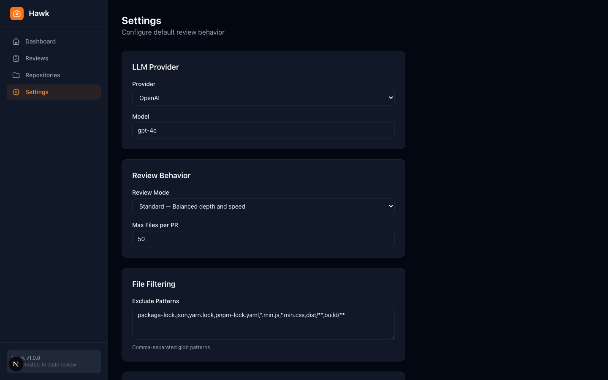

<p align="center">
  
</p>

<h1 align="center">Hawk</h1>

<p align="center">
  <strong>开源 AI 代码审查工具</strong>
</p>

<p align="center">
  免费、可自托管的 CodeRabbit 替代方案。GitHub Action + Web 控制台。
</p>

<p align="center">
  <a href="LICENSE"></a>
  <a href="https://github.com/your-org/hawk/stargazers"></a>
  <a href="https://github.com/your-org/hawk/issues"></a>
</p>

<p align="center">
  <a href="README.md">🇬🇧 English</a> •
  <a href="README.tr.md">🇹🇷 Türkçe</a> •
  <a href="README.fr.md">🇫🇷 Français</a>
</p>

---

## 问题

2026年，每个开发者都在用 AI 写代码。结果：

- PR 从 200 行暴涨到 2000+ 行
- 人工审查者跟不上节奏
- AI 生成的代码有 12-40% 的安全漏洞 (Forrester)
- CodeRabbit 每月 **$24** 且闭源
- PR-Agent (开源) 已被 **OpenAI 收购** (2026年3月)

**没有优质的、免费的、可自托管的 AI 代码审查工具。**

## 解决方案

Hawk 像高级工程师一样审查每个 PR — 免费、自托管、代码永不离开你的服务器。

```yaml
# .github/workflows/hawk.yml — 就这么简单。
name: Hawk Code Review
on: [pull_request]
jobs:
  review:
    runs-on: ubuntu-latest
    steps:
      - uses: actions/checkout@v4
      - uses: your-org/hawk@v1
        with:
          api-key: ${{ secrets.OPENAI_API_KEY }}
```

**一个 GitHub Action。每个 PR 都被 AI 审查。2 分钟。**

---

## 功能

| 功能 | 描述 |
|---|---|
| 🔒 **安全扫描** | XSS、注入、SSRF、硬编码密钥、路径遍历 |
| 🐛 **Bug 检测** | 空指针、竞态条件、差一错误、边界情况 |
| 📐 **代码质量** | 风格违规、代码重复、魔法数字、死代码 |
| 🧪 **测试覆盖** | 缺失测试用例、脆弱断言、未测试边界 |
| 🤖 **多 LLM** | OpenAI、Anthropic、DeepSeek、Ollama (本地/离线) |
| 📊 **Web 控制台** | 审查历史、分析、仓库管理、设置 |
| ⚡ **GitHub Action** | 1 分钟设置。每个 PR 运行。行内评论。 |
| 🔐 **隐私优先** | 自托管。代码永不离开服务器。Ollama 完全离线。 |

---

## 截图

### 控制台

<p align="center">
  
</p>

<p align="center"><em>总览：总审查数、平均分、发现的问题、成功率、最近审查、热门仓库</em></p>

### 审查列表

<p align="center">
  
</p>

<p align="center"><em>审查历史：分数、状态标签、问题数量</em></p>

### 审查详情

<p align="center">
  
</p>

<p align="center"><em>PR 评分、按文件的行内问题、严重性标签、代码建议</em></p>

### 仓库管理

<p align="center">
  
</p>

<p align="center"><em>添加仓库、开关审查、配置 LLM 设置、webhook 设置</em></p>

### 设置

<p align="center">
  
</p>

<p align="center"><em>配置 LLM 提供商、模型、审查模式和自定义指令</em></p>

---

## 快速开始

### 方案 A：仅 GitHub Action (CI)

```yaml
# .github/workflows/hawk.yml
name: Hawk Code Review
on: [pull_request]
jobs:
  review:
    runs-on: ubuntu-latest
    steps:
      - uses: actions/checkout@v4
      - uses: your-org/hawk@v1
        with:
          api-key: ${{ secrets.OPENAI_API_KEY }}
```

### 方案 B：完整平台 (控制台 + API)

```bash
git clone https://github.com/your-org/hawk.git
cd hawk
cp .env.example .env
# 编辑 .env 填入你的 API 密钥
npm install
npm run dev
```

控制台：**http://localhost:3000**
API：**http://localhost:4000**

### 方案 C：Docker

```bash
cp .env.example .env
docker-compose up -d
```

---

## 架构

```
┌─────────────────────────────────────────────────────────┐
│                    GitHub PR 事件                         │
└──────────────────────────┬──────────────────────────────┘
                           │
           ┌───────────────┴───────────────┐
           ▼                               ▼
   ┌──────────────┐               ┌────────────────┐
   │ GitHub Action │               │  Webhook/API   │
   │  (仅 CI)     │               │  (完整栈)      │
   └──────┬───────┘               └───────┬────────┘
          │                               │
          └───────────────┬───────────────┘
                          ▼
              ┌───────────────────────┐
              │    @hawk/core         │
              │  ┌─────────────────┐  │
              │  │  Diff 解析器    │  │
              │  │  git → 结构化   │  │
              │  └────────┬────────┘  │
              │           ▼           │
              │  ┌─────────────────┐  │
              │  │  审查引擎       │  │
              │  │  安全/风格      │  │
              │  │  Bug/测试/性能  │  │
              │  └────────┬────────┘  │
              │           ▼           │
              │  ┌─────────────────┐  │
              │  │  LLM 提供者     │  │
              │  │ OpenAI│Anthropic│  │
              │  │ DeepSeek│Ollama │  │
              │  └─────────────────┘  │
              └───────────────────────┘
```

### 包

| 包 | 描述 | 技术 |
|---|---|---|
| `@hawk/core` | Diff 解析器、LLM 提供者、审查引擎 | TypeScript |
| `@hawk/api` | Express API、SQLite、GitHub webhook | Express, sql.js |
| `@hawk/web` | 控制台 UI | Next.js 15, Tailwind CSS |
| `@hawk/action` | CI 的 GitHub Action | @actions/core |

---

## 对比

| | **Hawk** | CodeRabbit | PR-Agent (OpenAI) | Codium |
|---|---|---|---|---|
| **价格** | **免费** | $24+/月 | 免费 (OpenAI) | $15+/月 |
| **开源** | ✅ MIT | ❌ | ✅ (OpenAI 控制) | ❌ |
| **自托管** | ✅ | ❌ | ✅ | ❌ |
| **隐私** | ✅ 代码留在你这里 | ❌ 第三方 | ❌ 发送到 OpenAI | ❌ |
| **设置** | 1 分钟 | SaaS 注册 | 复杂 | SaaS 注册 |
| **本地 LLM** | ✅ Ollama | ❌ | ❌ | ❌ |

---

## Ollama 本地 LLM

Hawk 支持通过 Ollama 完全离线代码审查：

```bash
# 安装 Ollama
curl -fsSL https://ollama.ai/install.sh | sh

# 拉取代码模型
ollama pull codellama

# 在 GitHub Action 中使用
- uses: your-org/hawk@v1
  with:
    provider: ollama
    model: codellama
    ollama-url: http://your-server:11434
```

**你的代码永远不会离开你的网络。**

---

## 贡献

我们欢迎贡献！请查看 [CONTRIBUTING.md](CONTRIBUTING.md) 了解指南。

---

## 许可证

[MIT](LICENSE) — 随你怎么用。

---

<p align="center">
  <strong>🦅 由开发者构建，为开发者服务。</strong>
</p>
